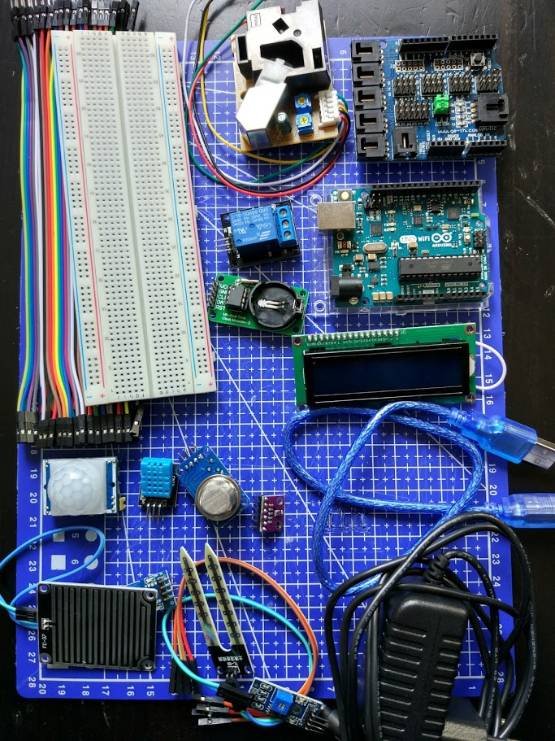

# Materiales

## LEDs
* Tiras de leds
* led RGB ¿mejor usar neopixel?
## Pulsadores/teclado
## Modulo de 2/4 reles
## Buzzer
## Caja para guardar todo
## ¿baterias/pilas?

* Controlador
* Sensores
  * luz
  * temperatura
  * humedad

* Wifi
* Placa de reles
* Alimentación
* Cables
